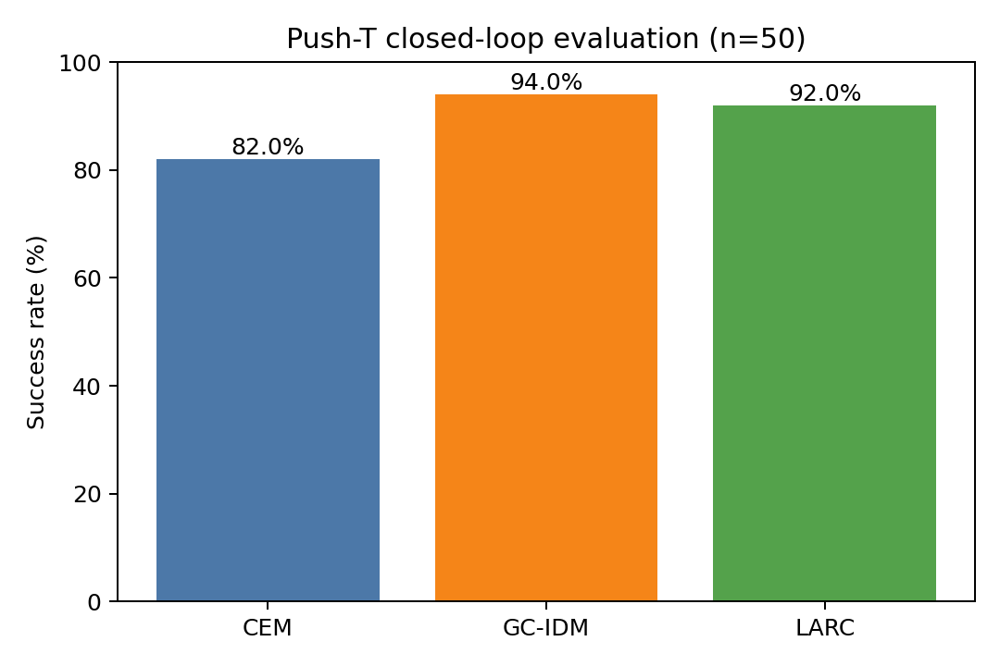
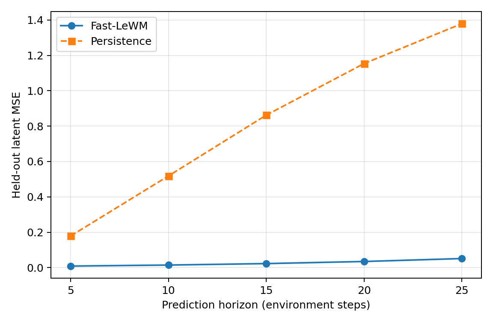

# Push-T experiment outcome

## Status and headline result

The end-to-end Push-T experiment completed successfully on 2026-07-13. The
pipeline cached the released LeWM representation, trained new Fast-LeWM
dynamics and two learned controllers, evaluated all three controllers on one
fixed 50-episode manifest, and generated versionable result figures.

On this manifest, both amortized controllers had higher point success rates and
lower evaluation times than online CEM:

| Method | Successes | Success rate | 95% Wilson CI | Evaluation time | Difference from CEM |
|---|---:|---:|---:|---:|---:|
| CEM | 41/50 | 82.0% | [69.2%, 90.2%] | 52.4 s | - |
| GC-IDM | 47/50 | 94.0% | [83.8%, 97.9%] | 6.4 s | +12 percentage points |
| LARC | 46/50 | 92.0% | [81.2%, 96.8%] | 5.9 s | +10 percentage points |

GC-IDM was about 8.2 times faster than CEM and LARC about 8.8 times faster for
the complete 50-episode evaluation. These ratios describe this run, not an
isolated controller-latency benchmark.



The compact result table is also available in
[the result summary](../results/RESULTS_pusht.md).

## Run provenance

The production run used:

- one NVIDIA GeForce RTX 4090 D with 24 GB of memory;
- BF16 mixed precision for all new training;
- training and split seed 3072;
- evaluation seed 42;
- a released Push-T LeWM checkpoint with SHA-256
  `c57169554d6ce0da6c7f100c67d84daf9cf7fb568558bfe106cc22d6c33ad624`;
- the repository state containing this report and its associated implementation
  changes.

At execution time the implementation changes were still based on Git commit
`184771c` and had not yet been committed. The eventual commit containing the
code, configs, tests, and this report should be treated as the durable source
provenance. Resolved Hydra configs and raw metrics remain with the external run
artifacts.

## Dataset and split

The source Push-T dataset was 46,300,921,856 bytes and contained 2,336,736
frames grouped into 18,685 episodes. Complete episodes were shuffled and split
before normalization or clip construction:

| Split | Episodes | Training examples |
|---|---:|---:|
| Train | 16,816 | 1,681,924 |
| Validation | 1,869 | 187,687 |

The dynamics, GC-IDM, and LARC dataset views have the same number of indexed
anchors, although their targets and valid horizons differ. No overlapping
window crosses the new episode-level split.

The frozen encoder/projector produced one 192-dimensional float16 latent per
frame. The resulting latent array occupied approximately 856 MiB. Raw actions
have dimension 2. Statistics computed only from training episodes were:

| Coordinate | Mean | Standard deviation |
|---|---:|---:|
| Action 0 | -0.00777574 | 0.20851026 |
| Action 1 | 0.00690762 | 0.20682467 |

Push-T uses a frameskip of 5, so five normalized two-dimensional environment
actions form one 10-dimensional model action block. The learned dynamics use a
maximum horizon of five blocks, corresponding to 25 environment steps.

The released LeWM representation and CEM checkpoint have upstream clip-level
split provenance. Consequently, the 1,869 validation episodes are held out
from the newly trained dynamics and policies, but they are not guaranteed to
be unseen by the upstream representation or CEM model. This limitation is
described fully in [the protocol](pusht_protocol.md).

## Models and training outcome

All new models used gradient clipping at 1.0, six data-loader workers, disabled
Weights & Biases logging, and crash-safe best/last checkpoints.

| Component | Trainable parameters | Epochs | Batch size | Learning rate | Weight decay | Best validation loss |
|---|---:|---:|---:|---:|---:|---:|
| Fast-LeWM dynamics | 10,065,984 | 10 | 1,024 | 5e-5 | 1e-3 | 0.02626369 at epoch 10 |
| GC-IDM | 1,547,778 | 50 | 2,048 | 1e-3 | 1e-4 | 0.13718541 at epoch 49 |
| LARC | 1,572,402 | 50 | 1,024 | 1e-3 | 1e-4 | 0.19305207 at epoch 50 |

The GC-IDM final validation loss was 0.13721974 at epoch 50, so closed-loop
evaluation correctly loaded its epoch-49 best weights. Fast-LeWM and LARC
reached their best reported validation losses at their final epochs.

The three loss values must not be compared directly. Fast-LeWM optimizes dense
latent prefix prediction, GC-IDM optimizes one-action regression, and LARC
combines behavior cloning with frozen-world-model rollout consistency.

### Fast-LeWM dynamics

The released ViT-Tiny encoder and projection MLP were frozen. Only the new
prefix dynamics were trained. Each example contains an anchor latent and up to
five causal action prefixes. Dense MSE supervision is applied at each prefix
endpoint.

### GC-IDM

GC-IDM predicts one normalized two-dimensional action from the current latent,
goal latent, and remaining horizon. It decodes that action to environment units
and replans after every environment step.

### LARC

LARC predicts five 10-dimensional action blocks. Its training objective combines
behavior cloning with a differentiable terminal-latent consistency term through
the frozen Fast-LeWM dynamics. During evaluation it executes five decoded raw
actions before replanning.

## Open-loop dynamics outcome

Open-loop evaluation used 100,000 held-out validation clips. Fast-LeWM was
compared with a persistence baseline that repeats the anchor latent:

| Environment steps | Fast-LeWM MSE | Persistence MSE |
|---:|---:|---:|
| 5 | 0.008709 | 0.178751 |
| 10 | 0.014419 | 0.518204 |
| 15 | 0.022708 | 0.862032 |
| 20 | 0.034548 | 1.153437 |
| 25 | 0.051198 | 1.379066 |

Prediction error increases with rollout horizon, but Fast-LeWM remains well
below persistence at all five endpoints. Persistence MSE is approximately 20
to 38 times higher over the measured horizons. This validates non-trivial
latent prediction; it does not by itself establish closed-loop control quality.



## Closed-loop evaluation protocol

All methods used exactly the same manifest:

- 50 unique validation episodes;
- one deterministic valid start per episode;
- a goal 25 environment steps after the start;
- a maximum budget of 50 environment steps;
- Push-T state and goal initialization from the offline episode;
- binary episode success as the reported metric;
- videos disabled.

CEM used the released checkpoint and its full-source action scaler. GC-IDM,
LARC, and Fast-LeWM used the new training-episode-only action statistics. This
is intentional: each controller must receive the normalization used during its
own training.

The CEM configuration used 300 candidates, 30 refinement steps, a top 30 set,
a five-block planning horizon, and warm starting. Its online optimization
explains the much higher evaluation time relative to the single-forward-pass
learned policies.

## Interpretation

The main outcome is that amortizing control into a learned policy worked on
this fixed protocol. GC-IDM improved the point success rate by six episodes and
LARC by five episodes relative to CEM, while both reduced total evaluation time
substantially.

GC-IDM and LARC differ by only one successful episode. With 50 evaluations and
overlapping Wilson intervals, this run does not support a strong claim that one
learned controller is better than the other. GC-IDM's per-step replanning may
help correct errors, while LARC reduces replanning frequency by committing five
raw actions; establishing that causal tradeoff requires dedicated ablations.

The open-loop curve supports the use of Fast-LeWM inside LARC's training loss:
the model predicts held-out latent evolution far better than persistence over
the full 25-step control horizon. The curve does not prove that every latent
prediction error is control-relevant.

## Limitations and follow-up work

1. The experiment uses one training seed and one evaluation manifest. Repeated
   training seeds and manifests are needed for variance estimates.
2. The upstream LeWM representation and CEM checkpoint do not share the new
   episode-level holdout guarantee.
3. Runtime includes the implemented evaluation path and is not a synchronized
   microbenchmark of controller inference alone.
4. Binary success omits trajectory efficiency, action smoothness, intermediate
   task score, and robustness to shifted initial conditions.
5. CEM uses released autoregressive dynamics, whereas LARC's consistency loss
   uses the newly trained Fast-LeWM dynamics. The comparison is an end-to-end
   controller comparison, not a controlled dynamics ablation.
6. The two-percentage-point GC-IDM/LARC gap is too small to interpret without
   more seeds and controller-specific ablations.

Useful next experiments are multiple training/evaluation seeds, a matched
dynamics study for CEM, LARC behavior-versus-consistency weight ablations,
commit-horizon ablations, and per-step latency profiling after CUDA
synchronization.

## Execution timeline

Times below are approximate wall times derived from artifact timestamps, except
for evaluation times recorded directly by the evaluator:

| Stage | Approximate duration | Primary output |
|---|---:|---|
| Latent caching | 11 min 26 s | Frame latent cache and metadata |
| Fast-LeWM training | 16 min 23 s | Best/last dynamics weights |
| Open-loop evaluation | 7 s | Metrics JSON and curve |
| GC-IDM training | 16 min 19 s | Best/last policy weights |
| LARC training | 1 h 7 min 44 s | Best/last policy weights |
| CEM closed loop | 52.4 s | 50 per-episode outcomes |
| GC-IDM closed loop | 6.4 s | 50 per-episode outcomes |
| LARC closed loop | 5.9 s | 50 per-episode outcomes |

All configured training epochs completed normally. There were no tracebacks in
the production evaluation logs.

## Verification

After the implementation changes and before the final production evaluation,
the remote project environment passed:

- `python -m pytest -q`: 18 tests passed;
- `python -m ruff check .`;
- `python -m ruff format --check .`;
- `git diff --check`.

A two-episode miniature dataset was also used to smoke-test latent caching,
all three trainers, all three closed-loop methods, open-loop evaluation, and
summary generation before the production run.

## Artifact map

Versionable artifacts are stored in the repository:

| Artifact | Path |
|---|---|
| Compact metrics | `results/RESULTS_pusht.md` |
| Success-rate figure | `results/pusht_success_rates.png` |
| Open-loop figure | `results/open_loop_curve.png` |
| Protocol and provenance | `docs/pusht_protocol.md` |
| This detailed outcome | `docs/experiment_outcome.md` |

Large artifacts remain outside Git under configured roots:

| Artifact | Configured location |
|---|---|
| Latent cache | `$ACT_LEWM_CACHE_ROOT/pusht/frame_latents` |
| Fast-LeWM checkpoints | `$ACT_LEWM_RUN_ROOT/pusht/world_model` |
| GC-IDM checkpoints | `$ACT_LEWM_RUN_ROOT/pusht/gc_idm` |
| LARC checkpoints | `$ACT_LEWM_RUN_ROOT/pusht/larc` |
| Raw evaluation JSON and manifest | `$ACT_LEWM_RUN_ROOT/pusht/eval` |
| Open-loop raw metrics | `$ACT_LEWM_RUN_ROOT/pusht/open_loop` |

The complete configured sequence can be reproduced with:

```bash
bash scripts/pusht_full.sh
```

after setting the environment variables documented in the README.
