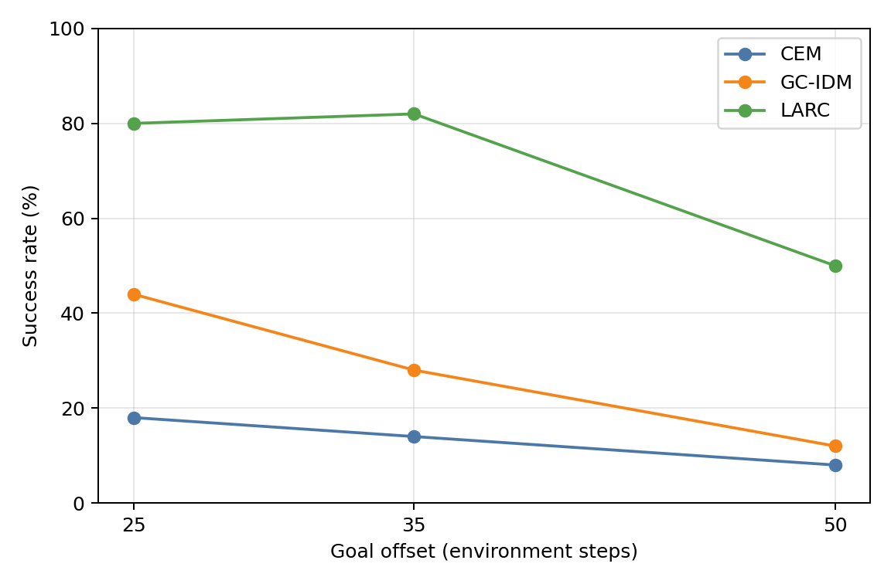
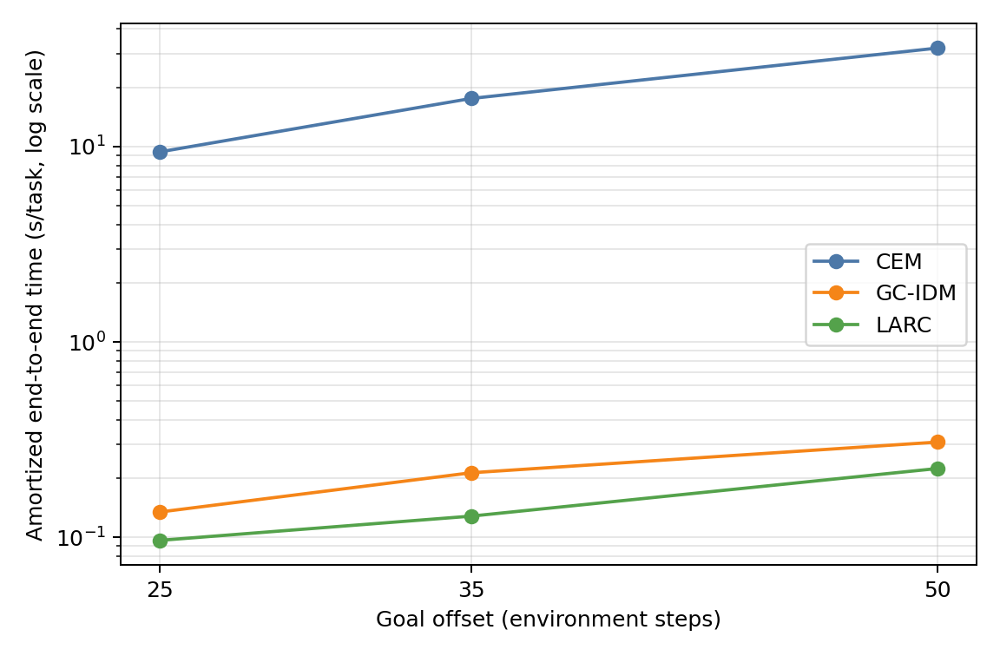

# Push-T horizon-stress results

Evaluation seed: `42`. The same `50` held-out episode/start pairs are reused at every goal offset and by every method.

| Goal offset | Method | Successes | Success rate | 95% Wilson CI | End-to-end s/task | Planning s/replan | Replans/task |
|---:|---|---:|---:|---:|---:|---:|---:|
| 25 | CEM | 9/50 | 18.0% | [9.8%, 30.8%] | 9.4019 | 1.0256 | 9.04 |
| 25 | GC-IDM | 22/50 | 44.0% | [31.2%, 57.7%] | 0.1347 | 0.0004 | 38.32 |
| 25 | LARC | 40/50 | 80.0% | [67.0%, 88.8%] | 0.0964 | 0.0010 | 6.08 |
| 35 | CEM | 7/50 | 14.0% | [7.0%, 26.2%] | 17.6393 | 1.3178 | 13.24 |
| 35 | GC-IDM | 14/50 | 28.0% | [17.5%, 41.7%] | 0.2139 | 0.0004 | 59.94 |
| 35 | LARC | 41/50 | 82.0% | [69.2%, 90.2%] | 0.1283 | 0.0008 | 8.20 |
| 50 | CEM | 4/50 | 8.0% | [3.2%, 18.8%] | 31.9673 | 1.6594 | 19.10 |
| 50 | GC-IDM | 6/50 | 12.0% | [5.6%, 23.8%] | 0.3072 | 0.0003 | 94.08 |
| 50 | LARC | 25/50 | 50.0% | [36.6%, 63.4%] | 0.2250 | 0.0005 | 14.86 |

## Paired success differences

Positive differences favor the first method. Discordant counts use the shared manifest order.

| Goal offset | Comparison | Difference | First only | Second only |
|---:|---|---:|---:|---:|
| 25 | LARC - CEM | +62.0 pp | 35 | 4 |
| 25 | LARC - GC-IDM | +36.0 pp | 19 | 1 |
| 25 | GC-IDM - CEM | +26.0 pp | 17 | 4 |
| 35 | LARC - CEM | +68.0 pp | 35 | 1 |
| 35 | LARC - GC-IDM | +54.0 pp | 28 | 1 |
| 35 | GC-IDM - CEM | +14.0 pp | 12 | 5 |
| 50 | LARC - CEM | +42.0 pp | 21 | 0 |
| 50 | LARC - GC-IDM | +38.0 pp | 20 | 1 |
| 50 | GC-IDM - CEM | +4.0 pp | 6 | 4 |

## Fast-LeWM open-loop validation

Held-out validation clips: `100000`.

| Environment steps | Fast-LeWM MSE | Persistence MSE |
|---:|---:|---:|
| 5 | 0.060238 | 0.165494 |
| 10 | 0.112167 | 0.493010 |
| 15 | 0.143702 | 0.834744 |
| 20 | 0.170858 | 1.133271 |
| 25 | 0.198838 | 1.372736 |
| 30 | 0.229499 | 1.551514 |
| 35 | 0.261813 | 1.677159 |
| 40 | 0.294918 | 1.761262 |
| 45 | 0.329785 | 1.814196 |
| 50 | 0.368971 | 1.843363 |

## Evaluation provenance

Code revision: `01eccc3ccafba8c1eae140d504ad8abe523484f0`.
Paired manifest SHA-256: `aa8c8845d82374807db8917f3876cc5db3722e3ef7b078841fd300abed5ae50d`.

| Artifact | SHA-256 |
|---|---|
| Latent cache metadata | e9e442d3609bf355494efbadfc4e099e15521e5cf597b5f7df3358e92a4b94b2 |
| Released LeWM config | 843ce3f0d2db9853dc111adcbdadeacfe0fda1a1af2ecdbd86cb2bef8a13cc64 |
| Released LeWM weights | 446262af36abba313e4436287dc904b68a49f4fda045fa1f974dd9959f532002 |
| Fast-LeWM config | ec05b434aaf293e58811e0c998edc1bb06fc79418ca5a6358d7b14d8f2350d05 |
| Fast-LeWM weights | a991a52dd061841ee6f1dd5a29cda616f88c1c07f77c1e3df14411438231d685 |
| GC-IDM config | 9a1bf029b5af1c4abdeca18fbfcb3a226d35ccaa73793c0e04131b7236cd0fe5 |
| GC-IDM weights | 4762d615087d705d02bf097a9e5be2abe2997df4ac789e6fa434b60e77bbf92f |
| LARC config | c3565d5c19d9b5335d89b307eaf4b46b674b1b83fa0d706f951d59f5ff4707cf |
| LARC weights | 580aaebeed988b006699caa798d42737fc48aebaaff4b494a561935118ec1972 |

Raw per-task metrics, resolved configurations, and the paired manifest remain in the external run directory.
