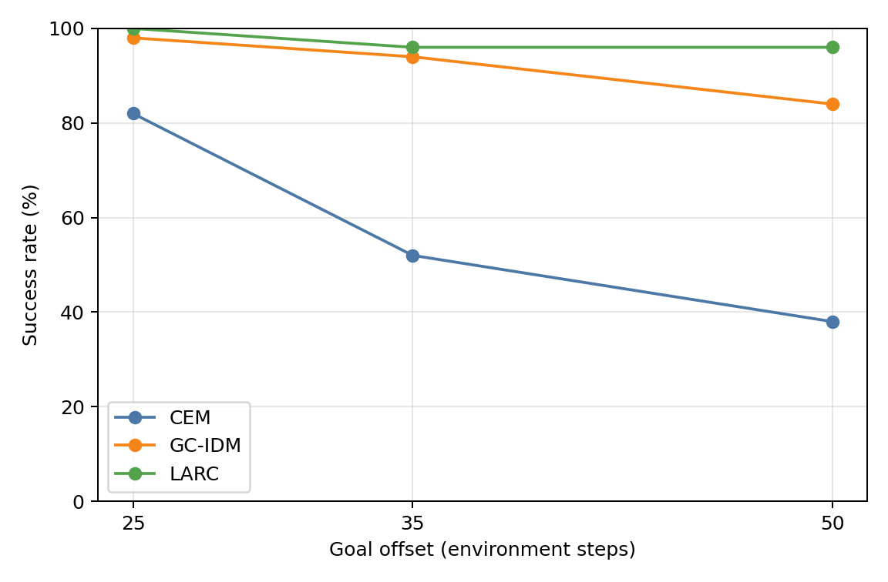
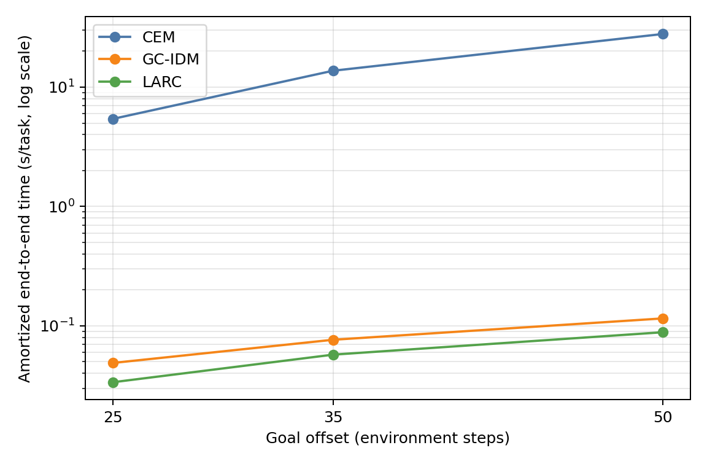
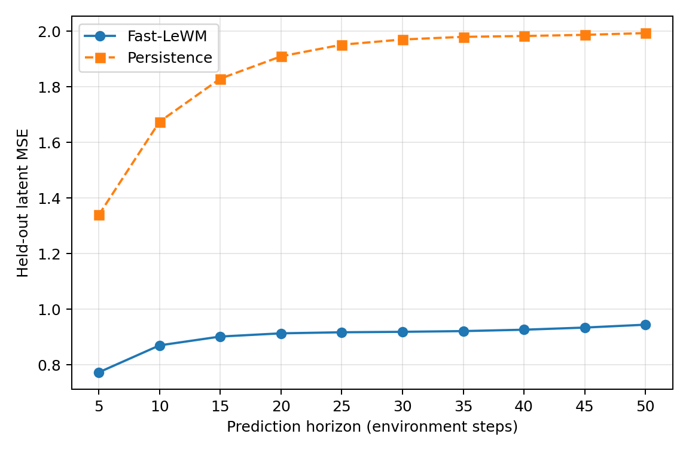

# Two-Room horizon-stress results

Evaluation seed: `42`. The same `50` held-out episode/start pairs are reused at every goal offset and by every method.

| Goal offset | Method | Successes | Success rate | 95% Wilson CI | End-to-end s/task | Planning s/replan | Replans/task |
|---:|---|---:|---:|---:|---:|---:|---:|
| 25 | CEM | 41/50 | 82.0% | [69.2%, 90.2%] | 5.4254 | 1.0596 | 5.08 |
| 25 | GC-IDM | 49/50 | 98.0% | [89.5%, 99.6%] | 0.0489 | 0.0013 | 13.40 |
| 25 | LARC | 50/50 | 100.0% | [92.9%, 100.0%] | 0.0337 | 0.0010 | 3.26 |
| 35 | CEM | 26/50 | 52.0% | [38.5%, 65.2%] | 13.7262 | 1.3036 | 10.46 |
| 35 | GC-IDM | 47/50 | 94.0% | [83.8%, 97.9%] | 0.0764 | 0.0009 | 25.96 |
| 35 | LARC | 48/50 | 96.0% | [86.5%, 98.9%] | 0.0573 | 0.0013 | 5.44 |
| 50 | CEM | 19/50 | 38.0% | [25.9%, 51.8%] | 27.8960 | 1.6902 | 16.42 |
| 50 | GC-IDM | 42/50 | 84.0% | [71.5%, 91.7%] | 0.1154 | 0.0006 | 45.66 |
| 50 | LARC | 48/50 | 96.0% | [86.5%, 98.9%] | 0.0884 | 0.0011 | 8.74 |

## Paired success differences

Positive differences favor the first method. Discordant counts use the shared manifest order.

| Goal offset | Comparison | Difference | First only | Second only |
|---:|---|---:|---:|---:|
| 25 | LARC - CEM | +18.0 pp | 9 | 0 |
| 25 | LARC - GC-IDM | +2.0 pp | 1 | 0 |
| 25 | GC-IDM - CEM | +16.0 pp | 9 | 1 |
| 35 | LARC - CEM | +44.0 pp | 23 | 1 |
| 35 | LARC - GC-IDM | +2.0 pp | 2 | 1 |
| 35 | GC-IDM - CEM | +42.0 pp | 22 | 1 |
| 50 | LARC - CEM | +58.0 pp | 30 | 1 |
| 50 | LARC - GC-IDM | +12.0 pp | 7 | 1 |
| 50 | GC-IDM - CEM | +46.0 pp | 25 | 2 |

## Fast-LeWM open-loop validation

Held-out validation clips: `42221`.

| Environment steps | Fast-LeWM MSE | Persistence MSE |
|---:|---:|---:|
| 5 | 0.772871 | 1.339171 |
| 10 | 0.869839 | 1.674477 |
| 15 | 0.901569 | 1.829334 |
| 20 | 0.913126 | 1.909589 |
| 25 | 0.916956 | 1.951431 |
| 30 | 0.918578 | 1.970218 |
| 35 | 0.921186 | 1.979735 |
| 40 | 0.926172 | 1.982730 |
| 45 | 0.933863 | 1.986861 |
| 50 | 0.944226 | 1.993175 |

## Evaluation provenance

Code revision: `b33bef913b0d8f237c1c4306660e5755d406c76f`.
Paired manifest SHA-256: `32511ee2e85bb33275478e30aa44cf8d7ab2d7479f14a3dd0735ee55756e7cc4`.

| Artifact | SHA-256 |
|---|---|
| Latent cache metadata | 888ee799bfa291ed7573d0807fea6e8029a7f475838dc74da311639bc2a6e7a5 |
| Released LeWM config | 843ce3f0d2db9853dc111adcbdadeacfe0fda1a1af2ecdbd86cb2bef8a13cc64 |
| Released LeWM weights | 8388bdd66894e0ef8075d85d951cff7251f8e56e6f37c9cf7ab515f8236aa762 |
| Fast-LeWM config | ec05b434aaf293e58811e0c998edc1bb06fc79418ca5a6358d7b14d8f2350d05 |
| Fast-LeWM weights | 999c236f4ed776be2405c1243f49867daa4ee89a259031df29ac1551e140387e |
| GC-IDM config | 9a1bf029b5af1c4abdeca18fbfcb3a226d35ccaa73793c0e04131b7236cd0fe5 |
| GC-IDM weights | 67c2ca04860025ac3cee446d456cab7df882845e9317a1d4d5dd43eecef9c2d1 |
| LARC config | c3565d5c19d9b5335d89b307eaf4b46b674b1b83fa0d706f951d59f5ff4707cf |
| LARC weights | 4fe1f3a508756c16f83fe8b1133f8c297dd058bbcbdc8bf1d50550da68200da3 |

Raw per-task metrics, resolved configurations, and the paired manifest remain in the external run directory.
